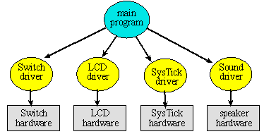
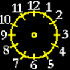
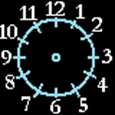
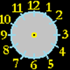
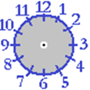
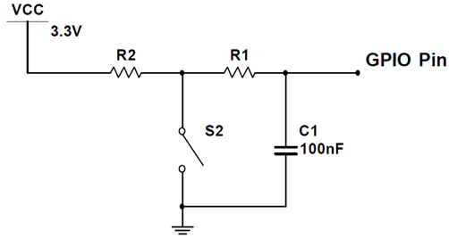
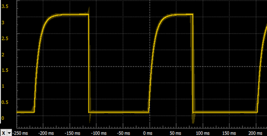

# Lab 3 Alarm Clock

## Table of Contents
0. [Repository Structure](#0-repository-structure)
    1. [HW](#01-hw)
    2. [SW](#02-sw)
    3. [Resources](#03-resources)
    4. [Git and Github](#04-git-and-github)
1. [Summary](#1-summary)
    1. [Goal](#11-goal)
    2. [Team Size](#12-team-size)
    3. [Background](#13-background)
    4. [Required Hardware](#14-required-hardware-ee445l-students-purchase-these-parts-for-themselves)
    5. [Required Parts](#15-required-parts-available-in-ece-checkout-desk)
    6. [Requirements Document](#16-requirements-document)
2. [Preparation](#2-preparation)
3. [Procedure](#3-procedure)
    1. [Build Circuit](#31-build-circuit)
    2. [Measure Noise](#32-measure-noise)
    3. [Measure Speaker Voltage](#33-measure-speaker-voltage)
    4. [Current Draw](#34-measure-current-draw)
4. [Checkout](#4-checkout)
5. [Report](#5-lab-report)
    1. [Deliverables](#51-deliverables)
    2. [Analysis and Discussion Questions](#52-analysis-and-discussion-give-short-1-or-two-sentence-answers-to-these-questions)
6. [Hints](#6-hints)

---

## 0 Repository Structure

The typical explanation for the repo structure. Lab specific instructions can be found further below.

### 0.1 HW

The `hw` folder should contain your schematic and board files for your PCB or circuits. In labs 1-5 and 10, you will be creating schematics for your circuit in EAGLE. A setup tutorial can be found [here](https://www.shawnvictor.net/autodesk-eagle.html).

### 0.2 SW

The `sw` folder should contain your application firmware and software written for the lab. The SW/inc folder contains firmware drivers written for you by Professor Valvano. Feel free to write your own (in fact, in some labs, you may be required to write your own).

You can place any other source files in the `sw/` folder. TAs will look at the files you create and/or modify for software quality and for running your project.

### 0.3 Resources

A couple files are provided in the Resources folder so you don't have to keep searching for that one TI document. Some of them are immediately useful, like the TM4C datasheet. Others may be useful for your final project, like the TM4C_System_Design_Guidelines page.

### 0.4 Git and Github

We will extensively use Git and Github for managing lab projects. This makes it easier for TAs to grade and help debug the project by allowing us to see commit histories, maintain a common project structure, and 
Likewise, it makes it easier for students to collaborate with partners, merge different codebases, and to debug their work by having a history of commits.

Two common ways of using Git and Github are [Github Desktop](https://desktop.github.com/) and the [command line](https://git-scm.com/downloads). [Tutorials](https://dev.to/mollynem/git-github--workflow-fundamentals-5496) are also abundant on the net for you to peruse. We've provided a cheatsheet for git in the Resources folder.

It is highly recommended to make the most out of Git, even if you've never used it before. Version control will save you a lot of suffering, and tools like Git or SVN are ubiquitous in the industry.

A gitignore file is added to the root of this repo that may prevent specific files from being tagged to the repo. This are typically autogenerated output files we don't care about, but sometimes other stuff (like .lib files) falls through that we want. Feel free to modify if necessary.

---

## 1 Summery

### 1.1 Goal
Labs in EE445L are extremely open ended. For Labs 3, 4 and 5 you will be given a requirements document. Your TA is your client or customer. A grade of B can be achieved by satisfying these minimum specifications. To achieve higher grades, you are expected to expand sections 2.1 and 2.5 describing what your system will do. You are free to make any changes to this document as long you achieve the educational goals for the lab. All changes must be approved by your TA. Excellent grades are reserved for systems with extra features and are easy to operate. You will need your LaunchPad and color LCD. From checkout you can borrow speaker, switches, IRLD024 or IRLD120 MOSFET, 1N914, and some resistors for this lab.

### 1.2 Team Size:
The team size for this lab is 2.

> Two shall be the number thou shalt count, and the number of the counting shall be two. Three shalt thou not count, neither count thou one, excepting that thou then proceed to two. Four is right out.

### 1.3 Background
Labs in EE445L are extremely open ended. For Labs 3, 4 and 5 you will be given a requirements document. Your TA is your client or customer. A grade of B can be achieved by satisfying these minimum specifications. To achieve higher grades, you are expected to expand sections 2.1 and 2.5 describing what your system will do. You are free to make any changes to this document as long you achieve the educational goals for the lab. All changes must be approved by your TA. Excellent grades are reserved for systems with extra features and are easy to operate. You will need your LaunchPad and color LCD. From checkout you can borrow speaker, switches, IRLD024 or IRLD120 MOSFET, 1N914, and some resistors for this lab.

### 1.4 Required Hardware (EE445L students purchase these parts for themselves)
| Part                          | Website                                                                       | Price     |
| ----------------------------- | ----------------------------------------------------------------------------- | --------- |
| EK-TM4C123GXL                 | [http://www.ti.com](http://www.ti.com)                                        | $12.99    |
| Sitronix ST7735R Color LCD    | [http://www.adafruit.com/products/358](http://www.adafruit.com/products/358)  | $12.99    |

### 1.5 Required Parts (available in ECE checkout desk)
| Part                  | www.mouser.com    | www.element14.com | www.digikey.com   | Price |
| --------------------- | ----------------- | ----------------- | ----------------- | ----- |
| IRLD120 MOSFET        | 844-IRLD120PBF    | 19K8369           | IRLD120PBF-ND     | $1.07 |
| IRLD024 MOSFET        | 844-IRLD024PBF    | 19K8367           | IRLD024PBF-ND     | $1.12 |
| Tactile switch        | 653-B3F-1050      | B3F-1050          | SW405-ND          | $0.29 |
| Speaker (8 or 32 ohm) |                   |                   |                   |       |

Any 8 to 32 ohm speaker will suffice, search speaker at
* [https://www.mouser.com](https://www.mouser.com)
* [https://www.digikey.com](https://www.digikey.com)
* [https://www.element14.com](https://www.element14.com)

### 1.6 Requirements document
1. Overview
    1. Objectives: Why are we doing this project? What is the purpose? 
        * The objectives of this project are to design, build and test an alarm clock. Educationally, students are learning how to design and test modular software and how to perform switch/keypad input in the background.
    
    2. Process: How will the project be developed? 
        * The project will be developed using the TM4C123 board. There will be switches or a keypad. The system will be built on a solderless breadboard and run on the usual USB power. The system may use the on board switches and/or the on board LEDs. Alternatively, the system may include external switches. The speaker will be external. There will be at least four hardware/software modules: switch/keypad input, time management, LCD graphics, and sound output. The process will be to design and test each module independently from the other modules. After each module is tested, the system will be built and tested.
    
    3. Roles and Responsibilities: Who will do what?  Who are the clients?
        * EE445L students are the engineers and the TA is the client. Students are expected to modify this document to clarify exactly what they plan to build. Students are allowed to divide responsibilities of the project however they wish, but, at the time of demonstration, both students are expected to understand all aspects of the design.
    
    4. Interactions with Existing Systems: How will it fit in?
        * The system will use the TM4C123 board, a ST7735 color LCD, a solderless breadboard, and be powered using the USB cable.
    
    5. Terminology: Define terms used in the document.
        * Power budget, device driver, critical section, latency, time jitter, and modular programming. See textbook for definitions.

    6. Security: How will intellectual property be managed?
        * The system may include software from Tivaware and from the book. No software written for this project may be transmitted, viewed, or communicated with any other EE445L student past, present, or future (other than the lab partner of course). It is the responsibility of the team to keep its EE445L lab solutions secure.

2. Function Description
    1. Functionality: What will the system do precisely?
        * The clock must be able to perform five functions. 1) It will display hours and minutes in both graphical and numeric forms on the LCD. The graphical output will include the 12 numbers around a circle, the hour hand, and the minute hand. The numerical output will be easy to read. 2) It will allow the operator to set the current time using switches or a keypad. 3) It will allow the operator to set the alarm time including enabling/disabling alarms. 4) It will make a sound at the alarm time. 5) It will allow the operator to stop the sound. An LED heartbeat will show when the system is running.

    2. Scope: List the phases and what will be delivered in each phase.
        * Phase 1 is the preparation; phase 2 is the demonstration; and phase 3 is the lab report. Details can be found in the lab manual.

    3. Prototypes: How will intermediate progress be demonstrated?
        * A prototype system running on the TM4C123 board, ST7735 color LCD, and solderless breadboard will be demonstrated. Progress will be judged by the preparation, demonstration, and lab report.

    4. Performance: Define the measures and describe how they will be determined.
        * The system will be judged by three qualitative measures. First, the software modules must be easy to understand and well-organized. Second, the clock display should be beautiful and effective in telling time. Third, the operation of setting the time and alarm should be simple and intuitive. The system should not have critical sections. All shared global variables must be identified with documentation that a critical section does not exist. Backward jumps in the ISR should be avoided if possible. The interrupt service routine used to maintain time must complete in as short a time as possible. This means all LCD I/O occurs in the main program. The average current on the +3.3V power will be measured with and without the alarm sounding. 

    5. Usability: Describe the interfaces. Be quantitative if possible.
        * Minimum requirements:
            1. There will be two switch inputs from PF0, PF4 (you can add additional external switches as well). In the main menu, the switches can be used to activate:
                1. set time
                2. set alarm
                3. turn on/off alarm
                4. display mode
            2. The user should be able to set the time (hours, minutes) and be able to set the alarm (hour, minute). Exactly how the user interface works is up to you. After some amount of inactivity the system reverts to the main menu. The user should be able to control some aspects of the display configuring the look and feel of the device. The switches MUST be debounced, so only one action occurs when the operator touches a switch once.
            3. The LCD display shows the time using graphical display typical of a standard on the wall clock. The 12 numbers, the minute hand, and the hour hand are large and easy to see. The clock must also display the time in numeric mode using numbers.
            4. The alarm sound can be a simple square wave. The sound amplitude will be just loud enough for the TA to hear when within 3 feet. 90% will be the maximum score for meeting all minimum requirements.
        * *To get full credit you must add two or more cool features in addition to the minimum requirements. Propose the features in preparation and TAs will determine how many points it is worth.*

    6. Safety: Explain any safety requirements and how they will be measured.
	    The alarm sound will be VERY quiet in order to respect other people in the room during testing. Connecting or disconnecting wires on the protoboard while power is applied may damage the board. 

3. Deliverables
    1. Reports: How will the system be described?
        A lab report described below is due by the due date listed in the syllabus. This report includes the final requirements document.

    2. Audits: How will the clients evaluate progress?
        The preparation is due at the beginning of the lab period on the date listed in the syllabus.

    3. Outcomes: What are the deliverables? How do we know when it is done?
        There are three deliverables: preparation, demonstration, and report.

---

## 2 Preparation
1. Copy and paste the requirements document from the lab manual. Edit it to reflect your design.
2. Draw a detailed circuit diagram showing all external hardware connections. We expect you to use Eagle (because this is the program with which we will be designing PCBs in Labs 6 and 7). More specifically, we want you to use the same CAD program you plan to use in Labs 6 and 7. Label all hardware chips, pin numbers, and resistor values. You do have to show connections to the LaunchPad, but not circuits within the LaunchPad itself. You must have in your possession all external hardware parts, but you do not have to construct the circuit. This parts requirement is relaxed for the labs first thing in the morning. To limit the surge current into the MOSFET, we recommend a 10k resistor between the digital output (500 Hz squarewave) and the gate of the MOSFET.
3. For each module you must have a separate header and code file. As stated earlier we expect at least four modules. As part of the preparation, you need to have the software designed, written and compiled. For the preparation, you do not need to have run or debugged any code. For the modules you have written include a main program that can be used to test it. The SysTick or timer module used to maintain time must be written at a low level, like the book, without calling TivaWare driver code. Other code (LCD, GPIO, and PLL) can use TivaWare driver code.
4. Write one main program that implements the digital alarm clock. Figure 3.1 shows the data flow graph of the alarm clock.

*Figure 3.1. Data flows from the timer and the switches to the LCD and speaker.*

Figure 3.2 shows a possible call graph of the system. Dividing the system into modules allows for concurrent development and eases the reuse of code.

*Figure 3.2. A call graph showing the four modules used by the alarm clock.*

---

## 3 Procedure

### 3.1 Build Circuit
1. Build and test any external hardware needed. Debug each module separately. Debug the overall alarm clock. Measure how long it takes to update the graphical time on the LCD. Identify all shared I/O ports and global variables. 
    * i.e. document in your software all the permanently allocated variables that have read or write access by more than one thread.
2. Next, consider what would happen if the interrupt occurred between any two instructions of the main program. Remember high priority interrupts can suspend lower priority ISRs. Look for critical sections, and if you find any remove them. Document in your software that each shared object is not critical. During checkout, the TA may ask you to prove that your system has no critical sections.)

#### Deliverable 1a

Draw the electrical circuit you used to create the alarm clock. You do not need to include any circuits on the LaunchPad (PF4-PF0 circuits).

#### Deliverable 1b

Measure how long it takes the LCD graphics to update.

### 3.2 Measure Noise

1. Record the +3.3V power line rms noise level. The easiest way to measure rms is to use the voltmeter in AC voltage mode. Theoretically one would expect this rms level to be zero, but the presence of noise will cause the rms value to be somewhere in the range of 0.5 to 5 mV. 

#### Deliverable 2

Show the RMS noise level on the 3.3V with and without the alarm sounding.

1. If you have access to a real oscilloscope, use it to measure the speaker voltage when the alarm is sounding.
    * i.e., measure the drain pin of the MOSFET (bottom side of the speaker).
    * Notice the small voltage spikes (4V peaks) that occur when current is turned off. Use the scope to verify the sound frequency is 500 Hz. 

*Figure 3.3a. Scope trace of the voltage on the speaker (the other speaker pin is +3.3V). Current flows when the drain pin is low. 8-ohm speaker 10k resistor between pin and gate, and IRLD120 MOSFET.*

### 3.3 Measure Speaker Voltage

*Note: Do either 3a or 3b, but not both.*

#### Deliverable 3a (real oscilloscope)

If you have access to a real oscilloscope, use it to measure the speaker voltage when the alarm is sounding. I.e., measure the drain pin of the MOSFET (bottom side of the speaker). Notice the small voltage spikes (4V peaks) that occur when current is turned off. Use the scope to verify the sound frequency is 500 Hz.

Measure the voltage versus time of the drain pin of the MOSFET, and use it to determine the current through the speaker. Measure the frequency of the sound. Place a picture of the scope trace like Figure 3.3a into your lab report, either a photo or digital downloaded image.

#### Deliverable 3b (TExaS oscilloscope)

If you do not have access to a real scope, use the TExaS scope to measure the **gate** of the MOSFET (digital squarewave), like Figure 3.3b. Verify the sound frequency is 500 Hz. Because the TExaS scope has a limit of 0 to 3.3V, please do not connect PD3 to the **drain** of the MOSFET. 

Use TExaS scope to measure voltage versus time on the gate pin of the MOSFET, and use it to measure the frequency of the sound. Place a screen shot of the scope trace like Figure 3.3b into your lab manual.

### 3.4 Measure Current Draw

# TODO add voltage supply to measure current

Measure the total current drawn by the entire system:
1. Set the DC power supply limits to 5V and 500mA
2. Connect the DC power supply to the LaunchPad's VBUS and GND
3. Measure the amount of current being drawn from the DC power supply

Measure the current drawn by each device:
1. Use a multimeter to measure the current running to each device separately
2. Devices to measure:
    * Speaker
    * LCD screen

#### Deliverable 4

Show the system current with and without the alarm sounding.

---

## 4 Checkout

You should be able to demonstrate all the required and “cool” features of your digital alarm clock. Demonstrate that your digital alarm clock is stand-alone by turning the power off, then on. The digital alarm clock should run (the time will naturally have to be reprogrammed) without downloading the software each time.

---

## 5 Lab Report

### 5.1 Deliverables
1. Objectives (final requirements document)
2. Hardware Design
    * Create a schematic or figure showing all external components connected to the TM4C123 board. You do not need to show hardware components on the TM4C123 LaunchPad board.
    * [Deliverable 1a](#deliverable-1a)
    * [Deliverable 1b](#deliverable-1b)
3. Software Design (upload your files as instructed by your TA)
	* If you organized the system different than Figure 3.1 and 3.2, then draw its data flow and call graphs 
4. Measurement Data
    * [Deliverable 2](#deliverable-2)
    * [Deliverable 3a](#deliverable-3a-real-oscilloscope)
    * [Deliverable 3b](#deliverable-3b-texas-oscilloscope)
    * [Deliverable 4](#deliverable-4)

### 5.2 Analysis and Discussion (give short 1 or two sentence answers to these questions)
1. Give two ways to remove a critical section.
2. What would be the disadvantage of updating the LCD in the background ISR?
3. Did you redraw the entire clock for each output? If so, how could you have redesigned the LCD update to run much faster, and create a lot less flicker? If not, how did you decide which parts to redraw?
4. Assuming the system were battery powered, list three ways you could have saved power.

---

## 6 Hints

1. The requirements document should change a couple of times during the lab as you determine features that can and cannot be performed.
2. You can interface an 8Ω or 32Ω speaker to an output port using an NPN MOSFET like the IRLD120. A 10k resistor between digital output pin and gate reduces current surges but does not affect loudness. Loudness is determined by the voltage drop across the speaker. Connect the source to ground, and the drain to one side of the speaker. Connect the other side to +3.3V. The maximum IDS of the transistor must be larger than 3.3V/8Ω or (3.3V/32Ω). The speaker has inductance, but the MOSFET includes an internal diode to remove back EMF when the transistor switches off. If you toggle the output pin in the background ISR, then sound will be generated. Loudness is determined by the voltage drop across the speaker. From Figure 3.3a, we see the MOSFET drain voltage is about 0.5V when active. So, the voltage drop will be 3.3V-0.5V = 2.7V
3. You must be careful not to let the LCD show an intermediate time of 1:00 as the time rolls over from 1:59 to 2:00. You must also be careful not to disable interrupts too long (more than one interrupt period), because a time error will result if any interrupts are skipped.
4. You may use 32-bit or 64-bit timer modes on the TM4C microcontrollers. However, it is good practice to refer to the errata for the microcontroller you are using. The errata describe bugs and flaws not listed in the data sheet.
5. If you use the on-board switches then you must activate the internal pull-up resistors. In particular, you will set the corresponding bits in the GPIO_PORTF_PUR_R register. These on-board switches are simply SPST switches to ground. When the switch is pressed, the signal goes to 0V (ground). When the switch is not pressed, the internal pull-up makes the signal go high (3.3V.) Furthermore, coming up out of a reset PF0 is locked, and thus if you use PF0 you will need to unlock it.
6. Learn to use Eagle. You will need to be proficient with this application during Labs 6 and 7. Using it now for simple circuits will be an efficient use of your time.
7. One way to design the graphical interface is to draw the static components of the clock in Paint, save as BMP, and convert the BMP into C code, and then use `ST7735_DrawBitmap` to draw the static image on the screen

8. If you use edge-triggered interrupts build an analog filter to debounce each switch. Set R1=0, and R2=100k to create the negative logic switch. Choose R2 and C1 so the time constant (τ=R2*C1) is around 10 ms. Test the circuit with a scope before connecting to the microcontroller

9. A better method to debounce edge-triggered interrupts is to use a second timer (see `EdgeInterruptDebounce_4C123`)