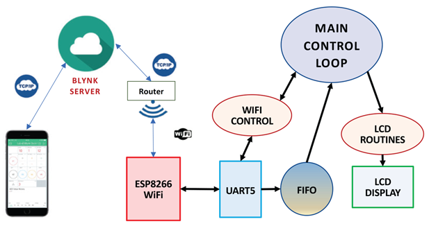
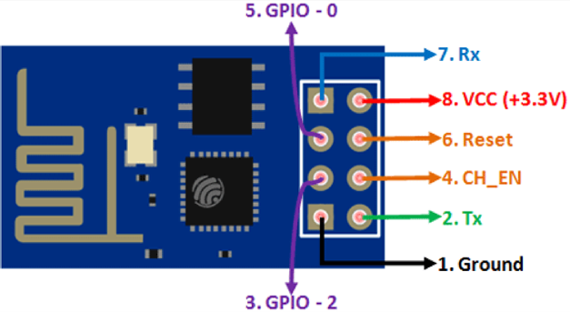
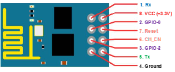
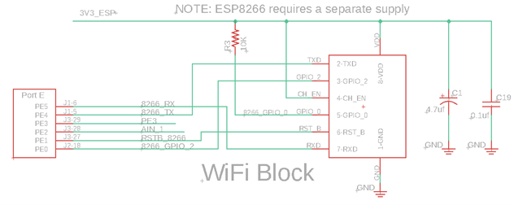
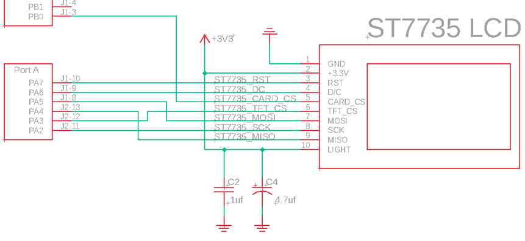
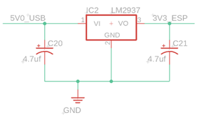
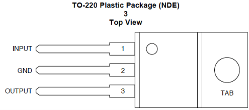
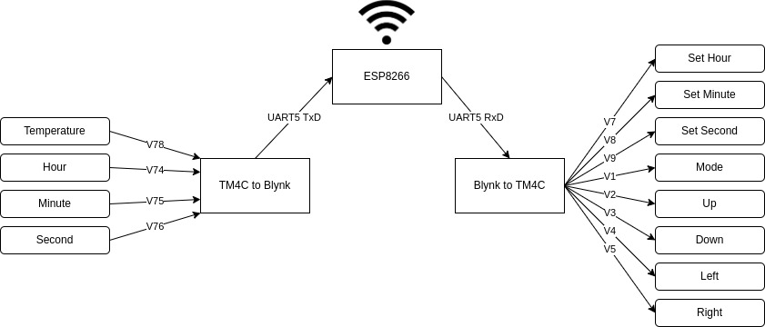

# Lab 4 Internet of Things

## Table of Contents

- [Lab 4 Internet of Things](#lab-4-internet-of-things)
  - [Table of Contents](#table-of-contents)
  - [0 Repository Structure](#0-repository-structure)
    - [0.1 HW](#01-hw)
    - [0.2 SW](#02-sw)
    - [0.3 Resources](#03-resources)
    - [0.4 Git and Github](#04-git-and-github)
  - [1 Summary](#1-summary)
    - [1.1 Goals](#11-goals)
    - [1.2 Team Size](#12-team-size)
    - [1.3 Review](#13-review)
    - [1.4 Background](#14-background)
    - [1.5 Required Hardware](#15-required-hardware)
    - [1.6 Specifications](#16-specifications)
    - [1.7 Interfaces](#17-interfaces)
    - [1.8 How to Power The System](#18-how-to-power-the-system)
  - [2 Preparation](#2-preparation)
    - [2.1 Setting Up Blynk](#21-setting-up-blynk)
    - [2.2 Edit `Lab3_4.c`](#22-edit-lab3_4c)
  - [3 Procedure](#3-procedure)
    - [3.1 Power the Devices](#31-power-the-devices)
    - [3.2 Run the Out of Box Blynk Code](#32-run-the-out-of-box-blynk-code)
    - [3.3 Merge Lab 3](#33-merge-lab-3)
      - [3.3.1 Deliverable 1](#331-deliverable-1)
      - [3.3.2 Deliverable 2](#332-deliverable-2)
    - [3.4 Measure the Current](#34-measure-the-current)
      - [3.4.1 Deliverable 3](#341-deliverable-3)
    - [4 Checkout](#4-checkout)
    - [5 Report](#5-report)
      - [5.1 Deliverables](#51-deliverables)
      - [5.2 Analysis and Discussion Questions](#52-analysis-and-discussion-questions)

---

## 0 Repository Structure

The typical explanation for the repo structure. Lab specific instructions can be
found further below.

### 0.1 HW

The `hw` folder should contain your schematic and board files for your PCB or
circuits. In labs 1-5 and 10, you will be creating schematics for your circuit
in EAGLE. A setup tutorial can be found
[here](https://www.shawnvictor.net/autodesk-eagle.html).

### 0.2 SW

The `sw` folder should contain your application firmware and software written
for the lab. The `sw/inc` folder contains firmware drivers written for you by
Professor Valvano. Feel free to write your own (in fact, in some labs, you may
be required to write your own).

You can place any other source files in the `sw/` folder. TAs will look at the
files you create and/or modify for software quality and for running your
project.

### 0.3 Resources

A couple files are provided in the Resources folder so you don't have to keep
searching for that one TI document. Some of them are immediately useful, like
the TM4C datasheet. Others may be useful for your final project, like the
TM4C_System_Design_Guidelines page.

### 0.4 Git and Github

We will extensively use Git and Github for managing lab projects. This makes it
easier for TAs to grade and help debug the project by allowing us to see commit
histories, maintain a common project structure, and likewise, it makes it easier
for students to collaborate with partners, merge different codebases, and to
debug their work by having a history of commits.

Two common ways of using Git and Github are [Github Desktop](https://desktop.github.com/) and the [command line](https://git-scm.com/downloads).
[Tutorials](https://dev.to/mollynem/git-github--workflow-fundamentals-5496) are also abundant on the net for you to peruse. We've provided a cheatsheet for git
in the Resources folder.

It is highly recommended to make the most out of Git, even if you've never used
it before. Version control will save you a lot of suffering, and tools like Git
or SVN are ubiquitous in the industry.

A gitignore file is added to the root of this repo that may prevent specific
files from being tagged to the repo. This are typically autogenerated output
files we don't care about, but sometimes other stuff (like .lib files) falls
through that we want. Feel free to modify if necessary.

---

## 1 Summary

### 1.1 Goals

* Implement a “smart object” that connects to a phone application (Blynk) via a
  cloud based server using the ESP8266 WiFi module connected to the TM4C123.
  (Fig 4.1)
* Remotely control the alarm clock developed in Lab 3 via the “Blynk Virtual
  Pin” interface.
* Replace the manual switches from Lab 3 with Virtual Pin (VP) Switches.
* Remotely read the Hour/Minutes/Seconds via the “Blynk Virtual Pin” interface.
  Display the data on the Blynk App.
* Extra Credit: Remotely read any sensor and via the “Blynk Virtual Pin”
  interface. Display the data on the Blynk App. Reading a sensor and displaying
  its value is an extra credit component.



*Figure 4.1*

### 1.2 Team Size

The team size for this lab is 2.

> Two shall be the number thou shalt count, and the number of the counting shall
> be two. Three shalt thou not count, neither count thou one, excepting that
> thou then proceed to two. Four is right out.

### 1.3 Review

* Valvano Section 11.4 on internet of things and this web page: [Internet Of Things](http://users.ece.utexas.edu/~valvano/Volume1/E-Book/C16_InternetOfThings.htm)
* [Getting started with the Blynk Application](https://blynk.io/en/getting-started)
* [Programming environment for the ESP8266](http://users.ece.utexas.edu/~valvano/EE445L/SetupESP8266ProgrammingEnvironment.htm)
* [Arduino programming](https://playground.arduino.cc/uploads/Main/arduino_notebook_v1-1.pdf)

### 1.4 Background

**WiFi** is the name given to devices that communicate wirelessly employing the
IEEE 802.11 standard. They typically operate in the 2.4 GHz
Industrial-Scientific-Medical (ISM) unlicensed band that is shared with ZigBee
(IEEE 802.15.4) and Bluetooth (IEEE 802.15.1) communications. The IEEE 802.11
standard describes how information is represented via radio frequency signals,
i.e., the **physical** or **PHY** layer, and how communications are formatted
and controlled.

### 1.5 Required Hardware

| Part Number       | Device Function   | Source                        | Price     |
| ----------------- | ----------------- | ----------------------------- | --------- |
| ESP8266           | WiFi module       | from TA                       | $3.50     |
| ST7735            | LCD module        | yours                         | $19.99    |
| EK-TM4C123GXL     | TiVa LaunchPad    | yours                         | $12.99    |
| Any analog sensor | Extracredit       | find it yourself (optional)   | ???       |
| LM2937-3.3        | 3.3V regulator    | from EER checkout desk        | $1.68     |

### 1.6 Specifications

This lab will create a “smart object” that connects to your smart phone via the
[Blynk](https://blynk.io/) application. Your system includes:

* A PC, running [PuTTY](https://www.putty.org/), connected to the TM4C123
  through UART0 (strongly suggested for debugging).
* A TM4C123 LaunchPad running your software.
* An ESP8266 WiFi module that is configured with the Blynk ESP8266 WiFi code.
* A ST7735 or any LCD showing the time.
* Use Lab 2 code to record incoming messages and outgoing jitter.

The minimum requirements are to be able to set time, set alarm, and visualize
the time from the phone. There must be at least 3 displays (hour, minute,
second) and 3 buttons.

Measure an external sensor using the ADC (extra credit). Any external sensor and
any interface method is okay (ADC, I2C, or SPI).

*NOTE: You will need access to a wireless access point, configured with or
without security.*

You are free to define the “look and feel” of your system as long as you meet
the specifications listed above. Feel free to write your code using the style
found in TivaWare or the book.

### 1.7 Interfaces

The TM4C123 system clock will be 80 MHz. The PC (via [PuTTY](https://www.putty.org/)) is connected to the
LaunchPad via UART0, which is embedded in the standard USB debugging cable. This
link is used for debugging. The starter code uses 115200 bits/sec, 1 stop, no
parity, and no flow control.

Use the Windows device manager to determine the COM port used to communication
communicate with your LaunchPad (in Device Manager, click View -> Show hidden
devices to view COM ports). The interface between the ESP8266/ST7735 and the
LaunchPad is shown below in Figures 4.3, 4.4, 4.5 and Table 4.1. The ESP8266
interface uses GPIO and UART ports on the LaunchPad. The ESP8266 interface uses
UART5 running at 9600 bits/sec, 1 stop, no parity, and no flow control.

*Note: There are two different pinout numbering schemes for the ESP8266. The
schematic in Figure 4.4 below uses the pinout numbering in 4.3(B) below.*




*Figure 4.3: ESP 8266 Pinout numbering*



*Figure 4.4: Detailed schematic of the ESP8266 interface. UART5 is used. The
+3V3 supply for the ESP8266 is different from the regular LaunchPad +3.3V, see
Figure 4.6.*



*Figure 4.5: Detailed schematic of the ST7735 interface. The CARD_CS pin (pin 5)
on the LCD is optional and needed only when the SDC card is being used. This
3.3V supply is the regular LaunchPad 3.3V.*

```
Pin   Signal       Direction      Pin   Signal        Direction
P1.1  3.3 VCC         Power       P2.1  Gnd   GND       Power       
P1.2  PB5 UNUSED      NA          P2.2  PB2   UNUSED    NA
P1.3  PB0 CARD_CS     OUT         P2.3  PE0   ESP_RDY   IN
P1.4  PB1 UNUSED      NA          P2.4  PF0   SWITCH    IN
P1.5  PE4 UNUSED      NA          P2.5  Reset nRESET    IN
P1.6  PE5 ESP_U5TX    OUT         P2.6  PB7   UNUSED    NA
P1.7  PB4 ESP_U5RX    IN          P2.7  PB6   UNUSED    NA
P1.8  PA5 TFT_MOSI    OUT         P2.8  PA4   TFT_MISO  IN
P1.9  PA6 TFT_DC      OUT         P2.9  PA3   TFT_CS    OUT
P1.10 PA7 TFT_RST     OUT         P2.10 PA2   TFT_SCK   OUT

Pin   Signal       Direction      Pin   Signal        Direction
P3.1  +5  +5 V        Power       P4.1  PF2 LED         OUT
P3.2  Gnd GND         Power       P4.2  PF3 LED         OUT
P3.3  PD0 TMP36_IN    IN          P4.3  PB3 UNUSED      NA
P3.4  PD1 UNUSED      NA          P4.4  PC4 UNUSED      NA
P3.5  PD2 UNUSED      NA          P4.5  PC5 UNUSED      NA
P3.6  PD3 UNUSED      NA          P4.6  PC6 UNUSED      NA
P3.7  PE1 ESP_RSTB    OUT         P4.7  PC7 UNUSED      NA
P3.8  PE2 UNUSED      NA          P4.8  PD6 UNUSED      NA
P3.9  PE3 Debug       OUT         P4.9  PD7 UNUSED      NA
P3.10 PF1 LED         OUT         P4.10 PF4 SWITCH      IN
```

*Table 4.1. ESP8266, ST7735 and TMP36 connections to the TM4C123 LaunchPad.*

### 1.8 How to Power The System

The ESP8266 draws too much current to be run off the 3.3V regulator on the
LaunchPad. To supply 3.3V to the ESP8266, you must build a separate 3.3V
regulator using the LM2937ET-3.3 linear regulator and two 4.7 uF tantalum
capacitors (see Figure 9.2 in the book, with Vin=5.0V and both capacitors 4.7
uF).

*Note: You must connect all the grounds together.*




*Figure 4.6: Regulator circuit using the LM2937 linear regulator. Please test
this circuit before attaching to ESP8266.*

---

## 2 Preparation

### 2.1 Setting Up Blynk

Read the instructions for running Blynk within [`BLYNK.md`](Blynk.md).

### 2.2 Edit `Lab3_4.c`

Modify and enable the line

`blynk_init("EE-IOT-Platform-03", "g!TyA>hR2JTy", "1234567890", USE_TIMER_INTERRUPT);`

to have the correct `wifi_ssid`, `wifi_pass`, and`blynk_auth_token`. Set
`USE_TIMER_INTERRUPT` to false if you want to manually pull updates from the
ESP8266 instead of relying on a populating queue. See the API for further usage.

---

## 3 Procedure

### 3.1 Power the Devices

1. Turn off power before connecting or disconnecting.
2. Connect the wires as shown in *Figure 4.4* and *Figure 4.5*.
3. Build and test the 3.3V regulator circuit shown in *Figure 4.6* before
   connecting this 3.3V output to the ESP8266. Place a current meter between the
   regulator output and the ESP8266 power input.
4. The power to the LaunchPad and ST7735R will be derived from the USB cable
   connected to the LaunchPad. Note that you will NOT remove the jumper from the
   LaunchPad (removing the jumper would remove power to the TM4C123, and nobody
   wants that). The 3.3V output of the regulator is ONLY used to power the
   ESP8266 (and not connected to the LaunchPad 3.3V).
5. Turn on the LaunchPad and verify 3.3V on the LaunchPad and 3.3V to the
   ESP8266. Debug the software as needed.

### 3.2 Run the Out of Box Blynk Code

1. Start a PuTTY monitor to view the debug statements that are output during
   Blynk's initialization.
2. Run the Lab4 code.
3. Press SW1 when prompted.
4. If the ESP8266 successfully connects, PuTTY should output text that looks
   similar to this:

```
ECE445L Lab 3 & 4.
Press SW1 to start.
Starting...
Resetting ESP8266.
Reset pin held low for 5 seconds.
Reset pin held high for 5 seconds.
ESP8266 Reset.
Setting up Wifi.
Waiting for RDY to pull high from the ESP8266.
SSID: <your_ssid>
PASS: <your_password>
Blynk auth code: <your_auth_code>
Waiting for debug info.
Waiting for RDY to pull low from the ESP.
...........Finished setting up Wifi.
Ready to talk to Blynk server.
```

### 3.3 Merge Lab 3

1. Choose virtual pins for sending data from Blynk to the TM4C (virtual pins V0
   -> V15)
2. Choose virtual pins for sending data from the TM4C to Blynk (virtual pins V70
   -> V99)

*Note: the available pins for sending data to and from the TM4C and Blynk can be
changed by reprogramming the ESP8266. The ESP8266 is programmed using the
Arduino IDE. You will need to check out a special programmer to reprogram the
ESP8266.*

3. Set up a Blynk palette to display the alarm clock and its different functionalities.
    * Minimum requirements:
        1. set time
        2. set alarm
        3. visualize time
4. Test the ESP8266 and TM4C system. *Figure 4.8* shows the dataflow diagram
   between the WiFI module and the “Smart Object”.



*Figure 4.8: ESP8266 and TM4C Dataflow Diagram*

5. **Extra credit:** Interface a sensor and use the ADC to measure the signal.
   Calibrate the sensor so it reads data in a human understandable fashion. One
   possibility uses the TMP36 to read temperature. The datasheet for the TMP36
   is located at: [ADI_TMP36](https://www.analog.com/media/en/technical-documentation/data-sheets/TMP35_36_37.pdf).

   You will have to determine how to convert the output voltage from the TMP36
   to °F and °C. These values will be sent on virtual pins V70 to V99 to the
   Blynk App. Another possibility is the slide-pot from EE319K.

#### 3.3.1 Deliverable 1

1. Add `DumpCapture` from `Lab2` to profile the interactions between the user
   and the alarm clock. For example, you can profile when button inputs occur
   and their outputs.
2. Add `JitterMeasure` from `Lab2` to capture and measure the jitter within your
   clock's timer.

#### 3.3.2 Deliverable 2

Take a screenshot of the Blynk interface illustrating the features of your system.

### 3.4 Measure the Current

1. Disconnect the USB cable from the PC.
2. Set the DC power supply's limits to +5V and 200mA.
3. Connect the +5V line to VBUS and GND to GND.
4. Measure the voltage on the TM4C's 3.3V pin and the 3.3V line coming out of
   the voltage regulator.
5. Measure the whole unit's current for:
   1. The clock without the ESP.
   2. The clock with the alarm on and without the ESP.
   3. The clock with the ESP.
   4. The clock with the alarm on and with the ESP.
6. Measure the current draw of the ESP:
   1. While it is not transmitting data.
   2. While it is transmitting data.
7. Measure the current draw of the LCD screen.

#### 3.4.1 Deliverable 3

Document the current measurements that you took.

---

### 4 Checkout

Demonstrate that your system can control the Clock on the TM4C display data
using the Blynk Application. Demonstrate that your system can read the sensor
(extra credit) and time on the TM4C. Upload your software as instructed by your
TA.

---

### 5 Report

#### 5.1 Deliverables

1. Objectives (1/2 page maximum)
2. Hardware design (if you included a new sensor for the extra credit)
3. Software design (upload your files as instructed by your TA)
4. [Deliverable 1](#deliverable-1)
5. [Deliverable 2](#deliverable-2)
6. [Deliverable 3](#deliverable-3)

#### 5.2 Analysis and Discussion Questions

Read the tutorial on the [Internet of Things](http://users.ece.utexas.edu/~valvano/Volume1/E-Book/C16_InternetOfThings.htm) before answering the following questions:

1. In the client server paradigm, explain the sequence of internet
   communications sent from client to server and from server to client as the
   client saves data on the server. Assume the client already is connected to
   the WiFi AP and the client knows the IP address of the server.
2. What is the purpose of the DNS?
3. What is the difference between UDP and TCP/IP communication? More
   specifically when should we use UDP and when should we use TCP/IP?
